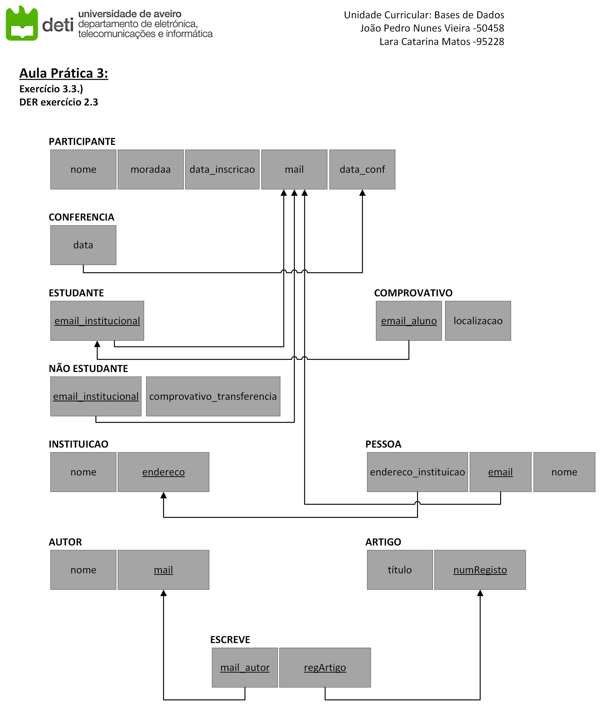

# BD: Guião 3


## ​Problema 3.1
 
### *a)*

```
Cliente - nome, endereço, num_carta, NIF
Aluguer - numero, duracao, data, cliente_nif, balcao_num, veiculo_matric
Balcao - nome, numero, endereco
Veiculo - matricula, ano, marca, cod_tipo
Tipo_Veiculo - designacao, arcondicionado, codigo
Ligeiro - numLugares, portas, combustivel, cod_tipo
Pesado - peso, passageiros, cod_tipo
Similaridade - cod_tipo1, cod_tipo2
```


### *b)* 

```
Cliente:
	CK(s): NIF, num_carta
	PK(s): NIF
	FK(s): none

Aluguer:
	CK(s): numero
	PK(s): numero
	FK(s): cliente_nif, balcao_num, veiculo_matric

Balcao:
	CK(s): numero
	PK(s): numero
	FK(s): none

Veiculo:
	CK(s): matricula
	PK(s): matricula
	FK(s): cod_tipo

Tipo_Veiculo:
	CK(s): codigo
	PK(s): codigo
	FK(s): none

Ligeiro:
	CK(s): cod_tipo
	PK(s): cod_tipo
	FK(s): cod_tipo

Pesado:
	CK(s): cod_tipo
	PK(s): cod_tipo
	FK(s): cod_tipo

Similaridade:
	CK(s): cod_tipo1, cod_tipo2
	PK(s): cod_tipo1, cod_tipo2
	FK(s): codigo, codigo
```


### *c)* 


## ​Problema 3.2

### *a)*

```
Airport - airport_code, city, state, name
Can_Land - airport_code, type_name
Airplane_type - type_name, max_seats, Company
Airplane - airplane_id, total_no_of_seats, type_name
Flight_leg - flight_num, Departure_Airport, Arriva_Airport, Leg_no, Scheduled_dep_time, Scheduled_arr_time
Flight - number, airline, weekdays
Fare - code, amount, restrictions, flight_num
Leg_instance - no_avail_seats, Date, Leg_no, flight_num, airport_id, arr_time, dep_time, airport_code1, airport_code2
Seat - Costumer_name, Cphone, Seat_no, Date, Leg_no, flight_num
```


### *b)* 

```
... Write here your answer ...
```


### *c)* 


## ​Problema 3.3


### *a)* 2.1


### *b)* 2.2


### *c)* 2.3



### *d)* 2.4

